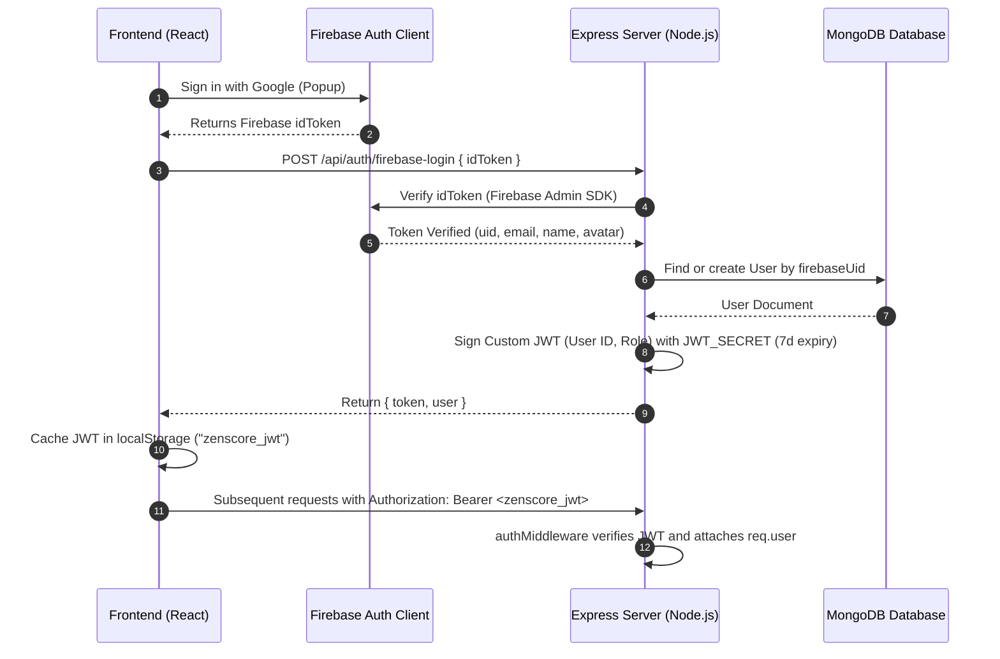
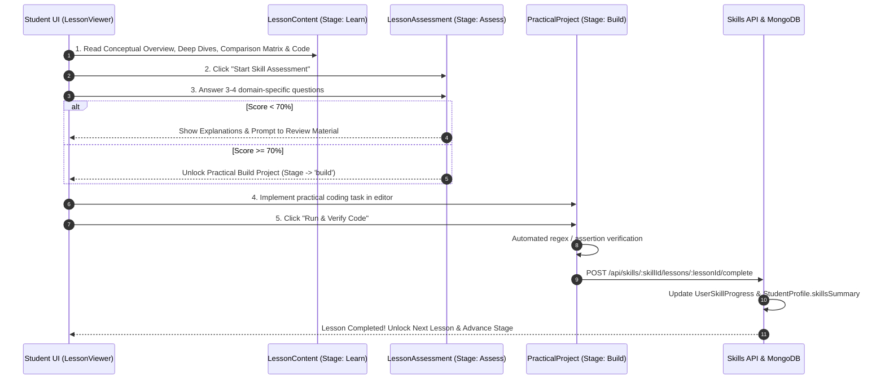

# ZenScore AI — Complete Master Project Context & Architectural Specification

> **System Version**: 2.5.0 Production Ready  
> **Last Updated**: August 2026  
> **Repository Type**: Full-Stack MERN Monorepo (Frontend: `zenscore-ai`, Backend: `zenscore-backend`)  
> **Document Purpose**: Complete system specification, user journey flow, database dictionary, and API catalog for developers and AI agents.

---

## 1. Executive Summary & Core Objectives

**ZenScore AI** is an end-to-end intelligent student companion and career acceleration ecosystem engineered for undergraduate engineering students in India. 

The application solves the four core pain points in engineering education:
1. **Academic Risk Prevention**: Instant GPA forecasting, OCR transcript parsing, subject health scoring, and syllabus-grounded AI tutoring.
2. **Interactive Skill Acquisition**: Replaces passive tutorial watching with a 4-stage pedagogical loop: **Learn (Deep-Dive) → Assess (Quiz ≥70%) → Build (Browser Test Runner) → Auto-Complete (MongoDB Sync)**.
3. **Structured Career Roadmaps**: 5 industry-standard prerequisite roadmaps linking directly to interactive learning modules.
4. **Placement Readiness**: AI-powered ATS resume analyzer, real-time AI mock interview simulator, and weighted placement readiness scoring.

---

## 2. Complete Technology Stack

```
┌────────────────────────────────────────────────────────────────────────────────────────┐
│                                   ZENSCRORE AI STACK                                   │
├──────────────────────────────────────────┬─────────────────────────────────────────────┤
│ FRONTEND (`zenscore-ai/`)                │ BACKEND (`zenscore-backend/`)               │
├──────────────────────────────────────────┼─────────────────────────────────────────────┤
│ • React 18.2.0 (Vite 5.4.21)             │ • Node.js v18+ & Express.js 4.18.2          │
│ • React Router DOM v6.22.0               │ • MongoDB Atlas & Mongoose ODM 8.23.0       │
│ • Tailwind CSS 3.4.1 & Framer Motion     │ • Groq Cloud SDK 0.37.0 (llama-3.3-70b)     │
│ • Lucide React Iconography 0.475.0       │ • Tesseract.js (eng.traineddata OCR)        │
│ • Firebase Auth Client SDK 10.14.1       │ • Firebase Admin SDK 12.0.0                 │
│ • Resilient API Layer (25s timeout retry)│ • JSON Web Tokens (jsonwebtoken 9.0.2)      │
│ • Debounced Background Cloud Sync Queue  │ • Morgan HTTP Logger & CORS 2.8.5           │
└──────────────────────────────────────────┴─────────────────────────────────────────────┘
```

---

## 3. Complete Page Routing & User Navigation Map

| Route URL | Component | Category | Description |
| :--- | :--- | :--- | :--- |
| `/` | `Home.jsx` | Public | Landing page with feature showcase, hero banner, value props. |
| `/login` | `Login.jsx` | Auth | Google OAuth popup + email/password authentication. |
| `/register` | `Register.jsx` | Auth | New student onboarding and registration. |
| `/dashboard` | `Dashboard.jsx` | Core App | Primary command center with academic health, current skills, and career widgets. |
| `/academics` | `Academics.jsx` | Academics | SGPA/CGPA dashboard, OCR transcript modal, GPA predictor, and AI Copilot. |
| `/skills` | `Skills.jsx` | Skills | Skills Hub (Explore tab, Roadmaps tab, Progress Tracker tab, Certificates tab). |
| `/skills/:skillId` | `SkillDetail.jsx` | Skills | **Interactive Skill Workspace**: Sticky outline, Learn deep-dive, Quiz, Code Runner. |
| `/courses` | `Courses.jsx` | Learning | Engineering course catalog (DSA, OS, DBMS, Networks, System Design). |
| `/courses/:id` | `CourseDetail.jsx`| Learning | Video module playlist player, lesson notes, and completion tracking. |
| `/careers` | `Careers.jsx` | Careers | AI Skill Gap matrix, 12-month roadmaps, ATS Resume scanner, AI Mock Interviews. |
| `/jobs` | `Jobs.jsx` | Placement | Filterable job/internship listings, application kanban, placement readiness score. |
| `/productivity` | `Productivity.jsx` | Productivity | Pomodoro timer, distraction logging, focus analytics, and peer leaderboard. |
| `/ai-tutor` | `AITutor.jsx` | AI Engine | Dedicated multi-turn engineering tutor with YouTube video recommendations. |
| `/profile` | `Profile.jsx` | User | Student profile (college, branch, semester, target roles, mastered skills). |
| `/study-groups` | `StudyGroups.jsx` | Community | Virtual study rooms, shared timers, and peer study groups. |

---

## 4. Architectural Sequence Diagrams

### 4.1 Hybrid Authentication (Firebase + Custom JWT)


---

### 4.2 Interactive Skills Pedagogical Pipeline


---

## 5. End-to-End Functional Modules Detail

### 5.1 Academics & Grade Intelligence
*   **Weighted SGPA/CGPA Calculation**: Supports 10-point Indian university grading scales (O=10, A+=9, A=8, B+=7, B=6, C=5, P=4, F=0) weighted by course credits.
*   **GPA Prediction Engine**: Applies trend regression analysis over historical semesters to estimate next-semester performance and highlight grade trajectory.
*   **Subject Health Visualizer**: Classifies subjects into *Good (≥7.5)*, *Average (6.5–7.4)*, and *At Risk (<6.5)*.
*   **Automated Study Plan Generator**: Generates custom weekly study hour allocations prioritized by subject credit weight and risk status.
*   **Tesseract OCR Marks Card Parser**:
    *   Preprocesses transcript images via thresholding and contrast normalization.
    *   Detects university layout profiles (**JNTU, VTU, Anna University, Autonomous**).
    *   Isolates tabular subject rows, extracts subject codes, names, grades, and credits.
    *   Groq LLM fallback for low-confidence scans or skewed mobile uploads.
*   **AI Academic Copilot & Tutor**: Context-aware chat powered by `llama-3.3-70b-versatile` with prompt builders injecting current semester syllabus and dynamic YouTube video recommendations.

---

### 5.2 Skills Hub & Interactive Learning Workspace
*   **Master Curriculum Repositories (`skillsCurriculumMap.js` & `skillsCurriculumDataset.js`)**:
    *   Comprehensive domain-specific curricula for **Docker & DevOps, Python & AI Engineering, React.js & Next.js, Node.js & Microservices, MongoDB & Database Systems, and Full-Stack MERN Architecture**.
    *   **Deep-Dive Conceptual Sub-Chapters**: Explains low-level mechanics (e.g. Linux namespaces/cgroups, Virtual DOM Fiber reconciliation, libuv event loop phases, BSON index trees).
    *   **Comparison Matrices**: Side-by-side technical trade-offs (e.g., VMs vs Containers, Real DOM vs Virtual DOM, SQL vs NoSQL).
    *   **Annotated Syntax Cheat Sheets**: Practical CLI commands and production code patterns with line-by-line annotations.
    *   **Common Pitfalls & Best Practices**: Real-world anti-patterns and performance optimizations.
*   **Interactive Quiz Engine (`LessonAssessment.jsx`)**:
    *   Multiple-choice questions tied to the reading material.
    *   Instant evaluation with technical explanations for right/wrong answers.
    *   Enforces ≥70% passing threshold to unlock the coding project.
*   **Practical Code Runner (`PracticalProject.jsx`)**:
    *   In-browser code editor with problem statements, starter templates, and requirements checklists.
    *   Instant regex and structural assertion verification test runner.
    *   Progressive hints and reference solution toggles.
    *   Auto-completes lesson and syncs completion percentage to MongoDB upon test pass.
*   **Curriculum Outline Sidebar (`ModuleSidebar.jsx`)**:
    *   Sticky module outline with visual checkmarks and milestone completion counters.
    *   Quick study launcher for **Ask AI Tutor Drawer** and **Markdown Lesson Notes Drawer**.
*   **Brand Icon System (`SkillIcon.jsx`)**:
    *   Renders distinct Lucide SVG brand icons for 30+ technologies without text badge clipping.

---

### 5.3 Production Skill Roadmaps Engine
*   **5 Pre-Seeded Industry Pathways**:
    1. 💻 **Full-Stack Web Development Path**: HTML Semantics → CSS Flex/Grid → JS ES6+ → React Architecture → Node.js APIs → MongoDB Aggregations.
    2. 🐳 **DevOps & Cloud Engineering Path**: Linux Admin → Docker & Multi-Stage Builds → CI/CD GitHub Actions → Kubernetes Orchestration → AWS Cloud Fundamentals.
    3. 🤖 **AI & Data Science Pathway**: Python Core → NumPy Vectors → Pandas Analytics → Scikit-Learn Classifiers → LLMs & RAG Pipelines.
    4. ⚡ **Backend & Microservices Architect Path**: Event Loop Internals → Express REST → JWT Security & RBAC → Indexing & Redis Caching → Microservices Architecture.
    5. 🎨 **Frontend UI/UX & React Specialist Path**: Semantic HTML5 → Tailwind CSS Design Systems → React 18 Fiber & Hooks → Performance Profiling → Next.js 14 App Router.
*   **Interactive Node Graph & Timeline**:
    *   Calculates prerequisite locks dynamically based on completed module IDs.
    *   Action buttons (**"Continue Learning"**, **"Review Lesson"**, **"Start Module"**) link directly to `/skills/:skillId` workspaces.
    *   Top banner with 1-click **"✨ Enter Interactive Learning Workspace"** launcher.

---

### 5.4 Courses, Certifications & Challenges
*   **Curated Course Catalog**: Engineering fundamentals (DSA, Operating Systems, Database Management, Computer Networks, System Design).
*   **Video Lesson Player**: Interactive lesson progress bar with timestamp bookmarks.
*   **Daily Academic Challenges (`DailyChallenge.js`)**: Daily coding and conceptual problems with streak tracking.
*   **Verified Certificates (`Certificate.js`)**: Generates unique verifiable certificate records upon 100% course or skill completion.

---

### 5.5 Career Intelligence, ATS Resume & Mock Interview Suite
*   **Skill Gap Analyzer**: Compares student mastered skills against target role profiles (e.g. Frontend Engineer, Full Stack MERN Developer, DevOps Engineer) to compute skill gap percentages and prioritized recommendations.
*   **ATS Resume Analyzer**:
    *   Parses student resumes, scores keyword relevancy against target job descriptions, identifies missing technical keywords, and provides actionable recruiter feedback.
    *   Exportable markdown/PDF resume templates optimized for applicant tracking systems.
*   **AI Mock Interview Suite**:
    *   Supports **Technical, HR, Coding, and System Design** interview modes.
    *   Generates dynamic follow-up questions based on student responses.
    *   Evaluates answers with clarity scores, technical accuracy metrics, and model answers.

---

### 5.6 Jobs & Placement Readiness Hub
*   **Job & Internship Catalog**: Searchable listings with filters for role, batch, salary range, and eligibility criteria.
*   **Application Tracker**: Kanban and list view tracking application statuses (*Applied, Screening, Interviewing, Offered, Rejected*).
*   **Placement Readiness Score**: Weighted algorithm computing readiness based on CGPA (25%), Skill Mastery (35%), Resume ATS Score (20%), and Mock Interview Performance (20%).

---

### 5.7 Productivity Suite
*   **Pomodoro Focus Timer**: Configurable work/break intervals with ambient background audio.
*   **Distraction & Focus Logging (`FocusLog.js`)**: Logs completed focus hours, subject tags, and distraction count.
*   **Leaderboards & Streaks**: Weekly student study leaderboards and active daily streaks.

---

## 6. Complete Database Models & Schemas

### 6.1 User Model (`models/User.js`)
```javascript
const userSchema = new mongoose.Schema({
  name: { type: String, required: true, trim: true },
  email: { type: String, required: true, unique: true, lowercase: true, trim: true },
  profileImage: { type: String, default: '' },
  firebaseUid: { type: String, required: true, unique: true },
  skills: [{ type: String }],
  cgpa: { type: Number, default: 0, min: 0, max: 10 },
  projectsCount: { type: Number, default: 0 },
  branch: { type: String, default: '' },
  college: { type: String, default: '' },
  yearOfStudy: { type: Number, default: 1 },
}, { timestamps: true })
```

### 6.2 Lesson Model (`models/Lesson.js`)
```javascript
const lessonSchema = new mongoose.Schema({
  skill: { type: mongoose.Schema.Types.ObjectId, ref: 'Skill', required: true },
  title: { type: String, required: true },
  lessonNumber: { type: Number, required: true },
  description: { type: String },
  introduction: { type: String },
  whatYouWillLearn: [{ type: String }],
  deepDiveSections: [{
    title: { type: String },
    explanation: { type: String },
    keyPoint: { type: String }
  }],
  comparisonTable: {
    title: { type: String },
    headers: [{ type: String }],
    rows: [[{ type: String }]]
  },
  coreConcepts: [{ type: String }],
  syntax: { type: String },
  codeExamples: [{
    language: { type: String },
    code: { type: String },
    explanation: { type: String }
  }],
  commonMistakes: [{ type: String }],
  bestPractices: [{ type: String }],
  summary: { type: String },
  estimatedMinutes: { type: Number, default: 30 },
  learningObjectives: [{ type: String }],
  resources: [{
    title: { type: String },
    url: { type: String },
    provider: { type: String },
    type: { type: String },
    difficulty: { type: String },
    estimatedMinutes: { type: Number }
  }],
  assessment: {
    questions: [{
      id: { type: String },
      question: { type: String },
      options: [{ type: String }],
      correctIndex: { type: Number },
      topic: { type: String },
      explanation: { type: String }
    }]
  },
  practicalTask: {
    title: { type: String },
    difficulty: { type: String },
    problemStatement: { type: String },
    instructions: { type: String },
    requirements: [{ type: String }],
    starterCode: { type: String },
    solutionCode: { type: String },
    hints: [{ type: String }]
  }
}, { timestamps: true })
```

### 6.3 SkillRoadmap Model (`models/SkillRoadmap.js`)
```javascript
const roadmapNodeSchema = new mongoose.Schema({
  nodeId: { type: String, required: true },
  title: { type: String, required: true },
  linkedSkill: { type: mongoose.Schema.Types.ObjectId, ref: 'Skill' },
  prerequisiteNodeIds: [{ type: String }],
  estimatedHours: { type: Number, default: 10 },
  order: { type: Number, required: true },
  isOptional: { type: Boolean, default: false },
  description: { type: String }
})

const skillRoadmapSchema = new mongoose.Schema({
  title: { type: String, required: true },
  slug: { type: String, required: true, unique: true },
  description: { type: String },
  icon: { type: String, default: '🚀' },
  estimatedHours: { type: Number, default: 40 },
  estimatedWeeks: { type: Number, default: 8 },
  category: { type: String, default: 'General' },
  difficulty: { type: String, enum: ['Beginner', 'Intermediate', 'Advanced'], default: 'Intermediate' },
  displayOrder: { type: Number, default: 0 },
  isPublished: { type: Boolean, default: true },
  nodes: [roadmapNodeSchema]
}, { timestamps: true })
```

### 6.4 UserSkillProgress Model (`models/UserSkillProgress.js`)
```javascript
const userSkillProgressSchema = new mongoose.Schema({
  user: { type: mongoose.Schema.Types.ObjectId, ref: 'User', required: true },
  skill: { type: mongoose.Schema.Types.ObjectId, ref: 'Skill', required: true },
  completedLessons: [{ type: mongoose.Schema.Types.ObjectId, ref: 'Lesson' }],
  bookmarkedLessons: [{ type: mongoose.Schema.Types.ObjectId, ref: 'Lesson' }],
  currentLesson: { type: mongoose.Schema.Types.ObjectId, ref: 'Lesson' },
  completionPercentage: { type: Number, default: 0 },
  assessmentScores: [{
    lesson: { type: mongoose.Schema.Types.ObjectId, ref: 'Lesson' },
    score: { type: Number },
    passed: { type: Boolean },
    completedAt: { type: Date, default: Date.now }
  }],
  lastAccessedAt: { type: Date, default: Date.now }
}, { timestamps: true })
```

---

## 7. Complete REST API Catalog

Protected routes require `Authorization: Bearer <zenscore_jwt>`.

### Authentication (`/api/auth`)
*   `POST /api/auth/firebase-login`: Exchanges Firebase ID token for custom backend session JWT.
*   `GET /api/auth/me`: Fetches authenticated user profile document.

### Skills & Learning Workspace (`/api/skills`)
*   `GET /api/skills`: Lists all published skills with category, difficulty, search, and pagination.
*   `GET /api/skills/categories`: Returns categories with active skill counts.
*   `GET /api/skills/continue-learning`: Returns user's in-progress skills with completion percentages.
*   `GET /api/skills/progress`: Fetches total lessons completed, overall mastery score, and learning streak.
*   `GET /api/skills/recommended`: Returns recommended skills tailored to user's branch and target role.
*   `GET /api/skills/ai-recommendations`: AI-generated skill gap recommendations.
*   `GET /api/skills/:skillId`: Returns complete skill curriculum, modules, rich lessons, deep dives, quizzes, tasks, and user progress.
*   `POST /api/skills/:skillId/enroll`: Enrolls user into a skill track.
*   `POST /api/skills/:skillId/lessons/:lessonId/complete`: Marks lesson as completed, recalculates progress %, and auto-issues certificate at 100%.
*   `POST /api/skills/:skillId/lessons/:lessonId/note`: Saves student private markdown notes for a lesson.
*   `POST /api/skills/:skillId/lessons/:lessonId/bookmark`: Toggles bookmark on a lesson.
*   `POST /api/skills/:skillId/ai-tutor`: Prompts Groq AI Tutor with the current lesson context.

### Production Roadmaps (`/api/roadmaps`)
*   `GET /api/roadmaps`: Lists all published roadmaps.
*   `GET /api/roadmaps/user`: Lists all roadmaps populated with user prerequisite completion and node unlock statuses.
*   `GET /api/roadmaps/:roadmapId`: Returns detailed roadmap node dependency tree.
*   `POST /api/roadmaps/enroll`: Enrolls user in a roadmap.
*   `PATCH /api/roadmaps/node/:nodeId`: Toggles completion checkmark for a roadmap node.

### Academics & OCR (`/api/academics` & `/api/ocr`)
*   `GET /api/academics/dashboard`: Returns user semester records, SGPA/CGPA, weak subjects, and GPA prediction.
*   `POST /api/academics/cgpa`: Creates/updates semester subject grades.
*   `POST /api/academics/predict`: Runs linear regression prediction for upcoming semester GPA.
*   `GET /api/academics/weak-subjects`: Returns subjects flagged with grade < 6.5.
*   `POST /api/academics/study-plan`: Generates weekly study schedule based on weak subjects.
*   `POST /api/ocr/parse-transcript`: Uploads transcript image, runs Tesseract OCR + university rule parser, and returns extracted grades.
*   `POST /api/ocr/confirm-import`: Saves confirmed OCR grades into `AcademicRecord`.

### Academic Copilot (`/api/copilot`)
*   `POST /api/copilot/chat`: Multi-turn conversational tutor with student academic context injection.
*   `GET /api/copilot/recommendations`: Returns AI study recommendations based on academic history.

### Courses & Certifications (`/api/courses`)
*   `GET /api/courses`: Lists course catalog with filters.
*   `GET /api/courses/:id`: Returns course details and video module playlist.
*   `POST /api/courses/:id/enroll`: Enrolls user in course.
*   `POST /api/courses/:id/progress`: Updates completed video index.
*   `GET /api/courses/certificates`: Returns user earned certificates.

### Career Intelligence & Interviews (`/api/careers`)
*   `GET /api/careers/paths`: Lists seeded career pathways.
*   `POST /api/careers/skill-gap`: Calculates skill gap score against selected target role.
*   `POST /api/careers/ai/analyze-resume`: AI ATS scanner auditing resume against job descriptions.
*   `POST /api/careers/ai/mock-interview`: AI mock interview conversational simulator.

### Productivity Suite (`/api/productivity`)
*   `POST /api/productivity/focus-log`: Records completed focus session duration and distraction count.
*   `GET /api/productivity/analytics`: Returns 7-day focus trends, top subject breakdown, and stats.
*   `POST /api/productivity/ai-suggestion`: AI productivity tip generator.

---

## 8. Comprehensive Directory Structures

### 8.1 Backend (`zenscore-backend/zenscore-backend/`)
```
zenscore-backend/
├── config/
│   ├── db.js                 # MongoDB connection setup via Mongoose
│   └── firebase.js           # Firebase Admin SDK initialization using environment variables
├── controllers/
│   ├── academicsController.js# Handles CGPA/SGPA, GPA prediction, weak subjects, study plans
│   ├── authController.js     # Handles Firebase token verification & JWT issuance/validation
│   ├── careersAIController.js# AI-driven career recommendations, skill gap analysis, roadmaps
│   ├── careersController.js  # CRUD & listings for seeded career paths and target roles
│   ├── copilotController.js  # AI Academic Copilot chat, context generation, smart recommendations
│   ├── coursesController.js  # Course catalog, enrollment, module progress, certificates, bookmarks
│   ├── jobsController.js     # Job search filters, application tracking, placement readiness scores
│   ├── ocrController.js      # Marks card / transcript OCR parsing & auto grade extraction
│   ├── productivityController.js # Focus sessions logger, analytics, distraction history, tips
│   ├── roadmapController.js  # Production roadmaps endpoints, node unlocks, progress updates
│   ├── skillsAdminController.js # Skills admin CMS controller
│   └── skillsController.js   # Skill tree categories, detailed curricula, and notes
├── middleware/
│   ├── adminMiddleware.js   # Protects admin-only routes
│   └── authMiddleware.js    # Validates JWT tokens and injects req.user context
├── models/
│   ├── AcademicRecord.js    # Schema for user semesters, subjects, grades, predicted GPA
│   ├── Bookmark.js          # Schema for user bookmarks (courses, roadmaps, jobs)
│   ├── CareerPath.js        # Schema for target roles, required skills, packages, roadmaps
│   ├── Certificate.js       # Schema for course & skill completion certificates
│   ├── Course.js            # Schema for curated courses, modules, lessons, quizzes
│   ├── CourseProgress.js    # Schema for user course completion and module tracking
│   ├── DailyChallenge.js    # Schema for daily coding & academic challenges
│   ├── FocusLog.js          # Schema for recorded study focus sessions
│   ├── ImportSession.js     # Schema for transcript OCR import sessions and review state
│   ├── JobListing.js        # Schema for active jobs/internships requirements
│   ├── Lesson.js            # Schema for skill lessons, deep dives, syntax, code examples, quizzes
│   ├── Notification.js      # Schema for user system & milestone notifications
│   ├── Skill.js             # Schema for skills registry, category, difficulty, estimated hours
│   ├── SkillCategory.js     # Schema for skill categories (Full Stack, Cloud, AI, etc.)
│   ├── SkillRoadmap.js      # Schema for multi-node prerequisite roadmaps
│   ├── User.js              # Schema for user profile, branch, overall CGPA, projects count
│   ├── UserLessonNote.js    # Schema for user lesson notes and bookmarks
│   ├── UserRoadmap.js       # Schema for customized user roadmaps & step checkmarks
│   └── UserSkillProgress.js # Schema for student skill progress, completed lessons, score
├── routes/
│   ├── academicsRoutes.js   # Route mappings for /api/academics/*
│   ├── aiTutorRoute.js      # Route mappings for /api/ai-tutor/*
│   ├── authRoutes.js        # Route mappings for /api/auth/*
│   ├── careersRoutes.js     # Route mappings for /api/careers/*
│   ├── copilotRoutes.js     # Route mappings for /api/copilot/*
│   ├── coursesRoutes.js     # Route mappings for /api/courses/*
│   ├── jobsRoutes.js        # Route mappings for /api/jobs/*
│   ├── ocrRoutes.js         # Route mappings for /api/ocr/*
│   ├── productivityRoutes.js# Route mappings for /api/productivity/*
│   ├── roadmapRoutes.js     # Route mappings for /api/roadmaps/*
│   ├── skillsAdminRoutes.js # Route mappings for /api/skills-admin/*
│   └── skillsRoutes.js      # Route mappings for /api/skills/*
├── services/
│   ├── ai/
│   │   ├── academicCopilotService.js # AI copilot prompt & context builder for academics
│   │   ├── aiProvider.js            # Unified Groq API client & fallback handler
│   │   ├── careersAIService.js      # Comprehensive AI engine for skill gap & roadmaps
│   │   ├── contextBuilder.js        # Assembles student academic & skill context for LLM
│   │   ├── promptBuilder.js         # Modular prompt construction pipeline
│   │   └── responseFormatter.js     # JSON/Markdown response sanitizer
│   ├── intelligence/
│   │   ├── analyticsService.js      # Academic performance & trend analytics
│   │   └── engines/                 # Mathematical prediction engines
│   ├── parser/
│   │   ├── creditCalculator.js      # Subject credit detection & default fallback rules
│   │   ├── decisionEngine.js        # OCR confidence threshold & fallback decision maker
│   │   ├── documentClassifier.js    # Identifies university marks cards / transcripts
│   │   ├── documentQualityAnalyzer.js# Evaluates image resolution, contrast, and noise
│   │   ├── fingerprint.js           # Document layout fingerprint matching
│   │   ├── gradeMappingService.js   # Converts letter grades to 10-point GPA scale
│   │   ├── groqFallback.js          # Vision/LLM fallback when rule parsing has low confidence
│   │   ├── profileDetector.js       # Auto-detects university profile (JNTU, VTU, Anna, etc.)
│   │   ├── profiles/                # University specific pattern definitions
│   │   ├── ruleParser.js            # Regex & spatial table parser for grades
│   │   ├── subjectConfidence.js     # Scores confidence per extracted subject row
│   │   ├── tableIsolator.js         # Isolates subject grade tables from transcript images
│   │   ├── utils/                   # Parser text normalization helpers
│   │   └── validationLayer.js       # Validates parsed grades, credits, and totals
│   ├── ocrService.js                # Tesseract OCR engine wrapper & image preprocessor
│   ├── roadmapService.js            # 5-roadmap seeder, prerequisite node unlocks, progress
│   ├── skillsCurriculumDataset.js   # Master domain educational curriculum service
│   └── skillsService.js             # Skill details, lessons, progress, and certificates
├── utils/
│   └── gpaUtils.js                  # Math utilities for SGPA/CGPA calculation & weighting
├── .env                         # Local environment configurations
├── package.json                 # Backend scripts and dependency management
└── server.js                    # Express server bootstrap, middleware, route mounts
```

### 8.2 Frontend (`zenscore-ai/zenscore-ai/`)
```
zenscore-ai/
├── public/                      # Static assets, icons, traineddata
├── src/
│   ├── components/
│   │   ├── academics/           # Academic components (SubjectTable, TranscriptOCRModal, SemesterTimeline, RiskCards)
│   │   │   ├── copilot/         # AI Copilot floating panel & chat widget
│   │   │   ├── intelligence/    # Performance analytics, GPA predictions, risk visualizers
│   │   │   ├── ocr/             # OCR transcript upload, preview, grade review editor
│   │   │   ├── onboarding/      # Academic initial setup wizard
│   │   │   └── planner/         # Weekly study planner, task allocation, productivity summary
│   │   ├── careers/             # Career intelligence components
│   │   │   ├── explorer/        # Career path explorer & role detail modal
│   │   │   ├── interview/       # AI Mock interview simulator & feedback cards
│   │   │   ├── resume/          # ATS resume scanner, recruiter feedback, export templates
│   │   │   ├── roadmap/         # Interactive node-based career roadmap graph
│   │   │   ├── sections/        # Section tabs for overview, skills, resume, interview
│   │   │   └── skillgap/        # Skill gap matrix, required vs missing skill bars
│   │   ├── common/              # Reusable UI elements (Modals, Badges, Tabs, Spinners)
│   │   ├── skills/              # Skills Hub & Roadmap components
│   │   │   ├── certificates/    # CertificatesSection, CertificateCard
│   │   │   ├── Explore/         # ExploreSection, SkillCard, SkillFilter, SkillGrid
│   │   │   ├── progress/        # ProgressDashboard, SkillProgressCard, AchievementsGrid
│   │   │   ├── roadmaps/        # RoadmapsSection, RoadmapCard, RoadmapProgress, RoadmapTimeline, RoadmapStep
│   │   │   ├── ContinueLearning.jsx
│   │   │   ├── SkillIcon.jsx    # SVG Lucide technology icons mapper
│   │   │   ├── SkillsHero.jsx
│   │   │   └── SkillsOverview.jsx
│   │   ├── AppLayout.jsx        # Global app layout with collapsible sidebar and search bar
│   │   ├── CoursesGrid.jsx      # Curated skills and CS course grid
│   │   ├── FeatureGrid.jsx      # Feature highlights section
│   │   ├── Footer.jsx           # Bottom navigation footer
│   │   ├── Hero.jsx             # Landing page banner
│   │   ├── Navbar.jsx           # Top navigation bar
│   │   ├── ProtectedRoute.jsx   # Route guard checking authentication state
│   │   └── WhyUs.jsx            # Value proposition section
│   ├── context/
│   │   ├── AuthContext.jsx      # Firebase auth listener & backend JWT session store
│   │   ├── CareerContext.jsx    # Global state manager for target role, skill gap, and roadmaps
│   │   └── StudentProfileContext.jsx # Global student profile caching and sync
│   ├── hooks/
│   │   ├── useAuth.js           # Custom hook to consume AuthContext
│   │   ├── useCareerData.js     # Custom hook for career intelligence
│   │   └── useSkillsData.js     # Master hook for Skills Hub, Roadmaps, Progress, Certificates
│   ├── pages/
│   │   ├── Academics.jsx        # Academic intelligence hub (Grades, OCR, GPA Predictor, Copilot)
│   │   ├── AITutor.jsx          # Engineering AI Tutor chat with Groq & YouTube integration
│   │   ├── Careers.jsx          # Career & Skill Gap Hub (Roadmaps, ATS Resume, AI Interview)
│   │   ├── Courses.jsx          # Full course catalog, enrolled courses, module player
│   │   ├── Dashboard.jsx        # Primary student command center with quick analytics
│   │   ├── Home.jsx             # Landing page for unauthenticated visitors
│   │   ├── Jobs.jsx             # Job listings, placement readiness calculator, application tracker
│   │   ├── Login.jsx            # Authentication login screen (Google popup + email)
│   │   ├── NotFound.jsx        # 404 page
│   │   ├── Productivity.jsx    # Pomodoro timer, focus logs, distraction tracker, leaderboard
│   │   ├── Profile.jsx         # Profile settings (branch, college, target role, skills)
│   │   ├── Register.jsx        # Sign up screen
│   │   ├── Skills.jsx          # Skill tree tracker, roadmaps, and progress tabs
│   │   ├── StudyGroups.jsx     # Virtual study rooms & Discord channel directory
│   │   └── skills/             # Interactive Skill Learning Workspace
│   │       ├── AITutorDrawer.jsx # Slide-over AI assistant for instant lesson explanations
│   │       ├── LessonAssessment.jsx # Interactive quiz component with scoring
│   │       ├── LessonContent.jsx    # Publication-grade deep-dive reading workspace
│   │       ├── LessonViewer.jsx     # Multi-stage learning flow manager (Learn -> Assess -> Build)
│   │       ├── ModuleSidebar.jsx    # Sticky curriculum outline with milestone tracker & study tools
│   │       ├── NotesDrawer.jsx      # Persistent lesson markdown notes manager
│   │       ├── PracticalProject.jsx # Hands-on code test runner & auto-completer
│   │       ├── ProgressCard.jsx     # Hero banner displaying skill stats & certification status
│   │       └── SkillDetail.jsx      # Main Skill Learning Workspace container
│   ├── services/
│   │   ├── ai/                  # 18 Modular AI client services (skillGapAIService, resumeATSService, etc.)
│   │   ├── careerMarket/        # 5 Market trend & salary insight services
│   │   ├── interview/           # 18 AI Mock interview, coding challenge & evaluation services
│   │   ├── resume/              # 5 Resume ATS metadata, section builder & exporter services
│   │   ├── roadmap/             # 17 Interactive roadmap execution, XP, streak & badge engines
│   │   ├── skills/              # Master frontend skills services
│   │   │   ├── skillsCurriculumDataset.js # Domain-specific curriculum resolver
│   │   │   ├── skillsCurriculumMap.js     # Comprehensive educational curricula definitions
│   │   │   ├── skillsNormalizer.js        # Normalizes API and fallback skill data with deep sections
│   │   │   ├── skillsProfileSync.js       # Background sync with StudentProfile
│   │   │   └── skillsService.js           # API calls for skills, lessons, notes, AI tutor
│   │   ├── api.js               # Base fetch client with 25s timeout and transient retry
│   │   ├── syncQueue.js         # Debounced offline-resilient background sync queue
│   │   └── copilotApi.js        # Academic Copilot API endpoints fetch client
│   ├── App.jsx                  # Main routes configuration & context providers
│   ├── firebase.js              # Client-side Firebase configuration
│   └── main.jsx                 # React DOM entry point
├── package.json                 # Dependencies and scripts
└── vite.config.js               # Vite configuration
```

---

## 9. Guidelines for AI Agents & Developers Prompting this Codebase

When continuing development or building new features using this context document, adhere to these golden principles:

1. **State & Sync Pattern**:
   - Always perform writes through `api.js` (which includes 25s timeout & auto-retry) or enqueue non-blocking profile writes via `syncQueue.js`.
2. **Pedagogical Standard for Skills**:
   - Never generate placeholder/template lessons. Every skill curriculum must supply: (1) Deep dive conceptual theory, (2) Visual comparison table, (3) Annotated syntax, (4) Minimum 3-question quiz assessment with explanations, (5) Practical coding task with runnable starter and test assertions.
3. **Roadmap Interactivity Standard**:
   - Every node on the roadmap timeline must have an active target `skillId` and navigate to `/skills/:skillId?lesson=N` with auto-enrollment.
4. **Error Boundaries & Zero Crash Policy**:
   - Wrap interactive modules in `<SectionErrorBoundary>` and handle network disconnects gracefully using local fallback caches.
